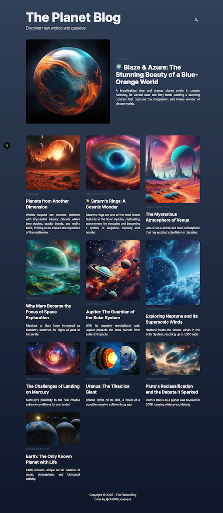

# 🌍 The Planet Blog

A visually stunning planet-themed blog built with **Next.js**, **Tailwind CSS**, and **TypeScript**.  
Discover new worlds, galaxies, and cosmic wonders through beautiful images and engaging articles.

## 🚀 Features

- **Dynamic blog posts** with title, excerpt, and publication date
- **Responsive design** optimized for desktop and mobile
- **Dark & light mode** support with smooth gradients
- **Featured post section** with large cover image
- **Reusable components** for Header, Post Cards, and Footer
- **Image-driven layout** to showcase planetary visuals
- **Login icon placeholder** for authentication

## 🛠️ Tech Stack

- **[Next.js](https://nextjs.org/)** – React framework for server-side rendering and static site generation
- **[Tailwind CSS](https://tailwindcss.com/)** – Utility-first CSS framework for styling
- **[TypeScript](https://www.typescriptlang.org/)** – Type-safe development
- **[clsx](https://github.com/lukeed/clsx)** – Conditional className handling
- **[Lucide Icons](https://lucide.dev/icons/)** – Icon library for login/profile buttons

## 📂 Project Structure

src/
components/
Header/ # Blog title, subtitle, and login button
PostCard/ # Individual blog post preview
Footer/ # Footer with credits
pages/
index.tsx # Home page listing all posts
styles/ # Global Tailwind styles
public/uploads/ # Blog cover images

## 🖼️ Screenshots



## 🔧 Installation

1. Clone the repository

```bash
# Clone the repository
git clone https://github.com/yourusername/the-planet-blog.git
cd the-planet-blog
```

2. Install all dependencies (must have node installed)

```bash
# Install dependencies
npm install
```

3. Configure your env.local file based on env.local-EXAMPLE

4. Create the database using drizzle

```bash
# Install dependencies
npm run migrate
```

5. (optional) Use seed for database population

```bash
# Install dependencies
npm run seed
```

6. Run the app

```bash
# Run the development server in developer mode
npm run dev

OR

# run in production mode
npm run build
npm start # apenas para test
```

7. Then open http://localhost:3000 in your browser.

---

✨ Done by @GHBAlbuquerque
`“Discover new worlds and galaxies.”`
